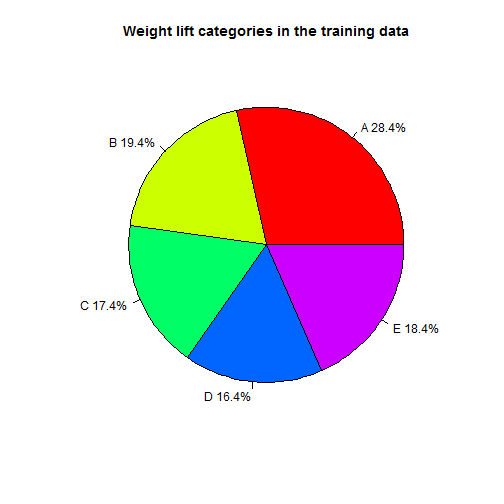
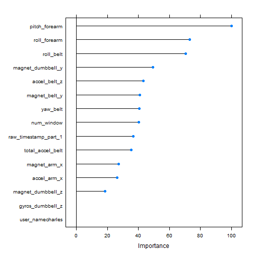
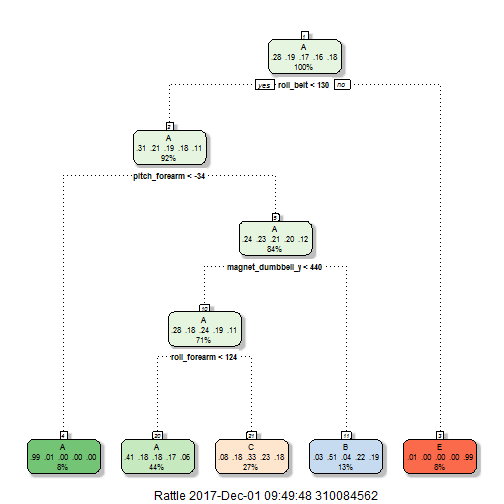
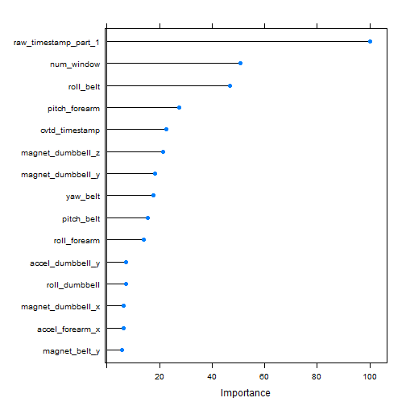

# Model Based Prediction of Physical Activity Monitoring Data
# Author:  JB
# Date:  December 1st, 2017


## Summary
The goal of this assignment is to evaluate the predictive accuracy of different types 
of machine learning models to determine how well they predict weight lifting exercises 
that were performed by and monitored on a group of volunteers.  These predictions were 
based on motion and time data collected by monitoring devices that were placed on the 
volunteers while they were doing the weight lifting exercises.  The weight lifting
exercises are broken down into the following five categories;  A) Done correctly,
B) throwing elbows to the front, C) lifting the dumbbell only half way, D) lowering 
the dumbbell only half way and E) throwing the hips to the front.  The models will be
used to predict which weight lifting categories were done using data from 20 test
cases, after the models have been trained on a seperate training data set.  Three
models will be evaluated: 1)  recursive partitioning and regression trees (rpart), 
2) random forests (rf) and 3) generalized boosted modeling (gbm).

## Data Loading and Exploratory Analysis
The following code will load the data and necessary libraries needed to perform the
predictive analysis.  The training dataset and 20 test cases will be loaded.  
In both datasets, the first column is just a row index, so it will be removed.
Blanks and the file NAs will be replaced with 'R' NAs. Columns with an NA percentage 
of over 50% will also be removed due to insufficent data for that particular 
measurement.  In the test cases, the last column will be removed since it just 
contains test case ID numbers.  Finally, one of the date timestamp columns will be 
converted from a factor to a date vector type.

Load the libraries:

```r
library(caret)
library(rattle)
library(lubridate)
```

Load and clean the training data and test cases:

```r
training_data <- read.csv("pml-training.csv", na.strings =c("","NA"))
training_data <- training_data[, -which(colMeans(is.na(training_data)) > 0.5)]
training_data <- training_data[,-1]
training_data$cvtd_timestamp <- dmy_hm(as.character(training_data$cvtd_timestamp))

testing_data <- read.csv("pml-testing.csv", na.strings = c("", "NA"))
testing_data <- testing_data[,-which(colMeans(is.na(testing_data)) > 0.5)]
testing_data <- testing_data[,-1]
testing_data <- testing_data[,-59]
testing_data$cvtd_timestamp <- dmy_hm(as.character(testing_data$cvtd_timestamp))
```

A subset of the training data is also generated to create a small test dataset
to evaluate the predictive accuracy of each model.  

```r
inTrain <- createDataPartition(y=training_data$classe, p=0.6, list=FALSE)
subtesting_data <- training_data[-inTrain,]
```

The following pie chart shows the breakdown of each category of weight lift that was
done in the training data set.  Each category is broken down as a percentage of the
total number of observations from the motion sensing devices in the dataset.

```r
counts_classe <- table(training_data$classe)
total_classe <- sum(counts_classe)
percent_classe <- round((counts_classe/total_classe)*100, 1)
lbls <- c("A","B","C","D","E")
lbls <- paste(lbls, percent_classe)
lbls <- paste(lbls,"%", sep="")
pie(counts_classe, labels = lbls, col=rainbow(length(lbls)), 
main= "Weight lift categories in the training data" )
```



**Figure 1:**  Pie chart showing the percentage breakdown of each weight lift category
in the training dataset.

##  Model Generation and Evaluation
In this section the three models described previously will be trained to the training
data.  To alleviate overfitting to the training data, k-fold cross-validation and 
repeated cross-validation will be performed during the training, depending on the 
model.

### Recursive Partitioning and Regression Tree (rpart) Model
Train the rpart model to the training data.  The weight lift category ("classe") is
the variable to be predicted.  10-fold cross-validation with 5 repeats was used.
The rpart model is good for quickly assessing important predictor variables with
a fast computation time.

```r
train_control <- trainControl(method = "repeatedcv", number=10, repeats=5)
model_rpart <- train(classe~., data=training_data, trControl = train_control, 
method = "rpart")
print(model_rpart)
```

```
## CART 
## 
## 19622 samples
##    58 predictor
##     5 classes: 'A', 'B', 'C', 'D', 'E' 
## 
## No pre-processing
## Resampling: Cross-Validated (10 fold, repeated 5 times) 
## Summary of sample sizes: 17659, 17660, 17659, 17660, 17660, 17659, ... 
## Resampling results across tuning parameters:
## 
##   cp          Accuracy   Kappa     
##   0.03891896  0.5342877  0.40085119
##   0.05998671  0.4185000  0.21275899
##   0.11515454  0.3269903  0.06493493
## 
## Accuracy was used to select the optimal model using  the largest value.
## The final value used for the model was cp = 0.03891896.
```

The model will now be used on the subset of test data to evaluate its accuracy
further.

```r
prediction_rpart <- predict(model_rpart, subtesting_data)
confusionMatrix(subtesting_data$classe, prediction_rpart)
```

```
## Confusion Matrix and Statistics
## 
##           Reference
## Prediction    A    B    C    D    E
##          A 2038   32  156    0    6
##          B  640  504  374    0    0
##          C  619   45  704    0    0
##          D  578  228  480    0    0
##          E  205  205  400    0  632
## 
## Overall Statistics
##                                           
##                Accuracy : 0.4943          
##                  95% CI : (0.4831, 0.5054)
##     No Information Rate : 0.52            
##     P-Value [Acc > NIR] : 1               
##                                           
##                   Kappa : 0.339           
##  Mcnemar's Test P-Value : NA              
## 
## Statistics by Class:
## 
##                      Class: A Class: B Class: C Class: D Class: E
## Sensitivity            0.4995  0.49704  0.33302       NA  0.99060
## Specificity            0.9485  0.85158  0.88416   0.8361  0.88762
## Pos Pred Value         0.9131  0.33202  0.51462       NA  0.43828
## Neg Pred Value         0.6363  0.91941  0.78234       NA  0.99906
## Prevalence             0.5200  0.12924  0.26944   0.0000  0.08132
## Detection Rate         0.2598  0.06424  0.08973   0.0000  0.08055
## Detection Prevalence   0.2845  0.19347  0.17436   0.1639  0.18379
## Balanced Accuracy      0.7240  0.67431  0.60859       NA  0.93911
```

From these results, the model had an out-of-sample accuracy of about 50%, and an
out of sample error also close to 50%.  So its predictive accuracy is not great.
Nevertheless, this model might provide some clues as to what predictor variables
might be important. Variable importance and tree plots of the model are shown.   

```r
variable_importance_rpart <- varImp(model_rpart)
```


```r
plot_var_rpart <-plot(variable_importance_rpart, top = 15)
print(plot_var_rpart)
```



**Figure 2:**  Plot of the top 15 most important predictors in the rpart model.


```r
fancyRpartPlot(model_rpart$finalModel)
```



**Figure 3:**  Tree plot of the trained rpart model.

From the plots, some variables are more important than others as predictors in
the model, such as roll_belt, roll-forearm, pitch_forearm and so on. So it could 
be worth considering these predictors in other models as well.  The rpart model
is not accurate enough, so random forests and generalized boosting will be 
evaluated next.  

### Random Forests (rf) Model
An rf model will be trained to see if predictive accuracy can be
improved compared to the rpart model.  This model is usually quite accurate and can 
deal with a wide range of predictor variable types, but it is computationally 
intensive.  A simple 5-fold cross-validation will be used to save on computation 
time.

```r
train_control2 <- trainControl(method="cv", number =5)
model_rf <- train(classe~., data=training_data, trControl = train_control2, 
method = "rf")
print(model_rf)
```

```
## Random Forest 
## 
## 19622 samples
##    58 predictor
##     5 classes: 'A', 'B', 'C', 'D', 'E' 
## 
## No pre-processing
## Resampling: Cross-Validated (5 fold) 
## Summary of sample sizes: 15697, 15698, 15699, 15697, 15697 
## Resampling results across tuning parameters:
## 
##   mtry  Accuracy   Kappa    
##    2    0.9975539  0.9969058
##   32    0.9994394  0.9992909
##   62    0.9988278  0.9985173
## 
## Accuracy was used to select the optimal model using  the largest value.
## The final value used for the model was mtry = 32.
```

```r
print(model_rf$finalModel)
```

```
## 
## Call:
##  randomForest(x = x, y = y, mtry = param$mtry) 
##                Type of random forest: classification
##                      Number of trees: 500
## No. of variables tried at each split: 32
## 
##         OOB estimate of  error rate: 0.05%
## Confusion matrix:
##      A    B    C    D    E  class.error
## A 5580    0    0    0    0 0.0000000000
## B    1 3795    1    0    0 0.0005267316
## C    0    5 3417    0    0 0.0014611338
## D    0    0    2 3213    1 0.0009328358
## E    0    0    0    0 3607 0.0000000000
```

Determine and plot the top 15 most important predictors for the rf model.

```r
variable_importance_rf <- varImp(model_rf)
plot_var_rf <- plot(variable_importance_rf, top = 15)
print(plot_var_rf)
```



**Figure 4:**  Plot of the top 15 most important predictors in the rf model.

Use the subset of test data to evaluate the rf model predictive accuracy.

```r
prediction_rf <- predict(model_rf, subtesting_data)
confusionMatrix(subtesting_data$classe, prediction_rf)
```

```
## Confusion Matrix and Statistics
## 
##           Reference
## Prediction    A    B    C    D    E
##          A 2232    0    0    0    0
##          B    0 1518    0    0    0
##          C    0    0 1368    0    0
##          D    0    0    0 1286    0
##          E    0    0    0    0 1442
## 
## Overall Statistics
##                                      
##                Accuracy : 1          
##                  95% CI : (0.9995, 1)
##     No Information Rate : 0.2845     
##     P-Value [Acc > NIR] : < 2.2e-16  
##                                      
##                   Kappa : 1          
##  Mcnemar's Test P-Value : NA         
## 
## Statistics by Class:
## 
##                      Class: A Class: B Class: C Class: D Class: E
## Sensitivity            1.0000   1.0000   1.0000   1.0000   1.0000
## Specificity            1.0000   1.0000   1.0000   1.0000   1.0000
## Pos Pred Value         1.0000   1.0000   1.0000   1.0000   1.0000
## Neg Pred Value         1.0000   1.0000   1.0000   1.0000   1.0000
## Prevalence             0.2845   0.1935   0.1744   0.1639   0.1838
## Detection Rate         0.2845   0.1935   0.1744   0.1639   0.1838
## Detection Prevalence   0.2845   0.1935   0.1744   0.1639   0.1838
## Balanced Accuracy      1.0000   1.0000   1.0000   1.0000   1.0000
```

From these results, there is a lot of overlap between the first few most important
predictors of the rpart and rf models, but their order of importance is different.  
The rf model was computationally intensive, requiring about 15 minutes to train 
on my PC.  However, the rf model is much more accurate than rpart, in excess of 
99.9% (out of sample error < 0.1%).  I tested the rf model using the top six most 
important predictors from the rpart model.  This reduced the computation time to 
about 2.5 minutes, but reduced accuracy of the rf model to about 94% (around 6% 
out-of-sample error rate) which is still very good.  However this error rate could
lead to 1 or 2 errors when using it to predict the weight lift category of the 20 
test cases.  So for this assignment, all predictors will be used.  

### Generalized Boosted Model (gbm)
This model was tested to see if it could achieve accuracy close to rf, but with 
reduced computation time.  It boosts weak predictors, so all predictors will be
used to train the model.  Again, 5-fold cross-validation was used on the training
dataset.  

```r
model_gbm <- train(classe~., data=training_data, trControl = train_control2, 
method = "gbm", verbose=FALSE)
print(model_gbm)
```

```
## Stochastic Gradient Boosting 
## 
## 19622 samples
##    58 predictor
##     5 classes: 'A', 'B', 'C', 'D', 'E' 
## 
## No pre-processing
## Resampling: Cross-Validated (5 fold) 
## Summary of sample sizes: 15698, 15697, 15698, 15698, 15697 
## Resampling results across tuning parameters:
## 
##   interaction.depth  n.trees  Accuracy   Kappa    
##   1                   50      0.8142895  0.7645051
##   1                  100      0.8866067  0.8564447
##   1                  150      0.9175416  0.8956210
##   2                   50      0.9364490  0.9195641
##   2                  100      0.9777796  0.9718843
##   2                  150      0.9906735  0.9882029
##   3                   50      0.9702884  0.9624057
##   3                  100      0.9929160  0.9910398
##   3                  150      0.9965345  0.9956167
## 
## Tuning parameter 'shrinkage' was held constant at a value of 0.1
## 
## Tuning parameter 'n.minobsinnode' was held constant at a value of 10
## Accuracy was used to select the optimal model using  the largest value.
## The final values used for the model were n.trees = 150,
##  interaction.depth = 3, shrinkage = 0.1 and n.minobsinnode = 10.
```

```r
prediction_gbm <- predict(model_gbm, subtesting_data)
confusionMatrix(subtesting_data$classe, prediction_gbm)
```

```
## Confusion Matrix and Statistics
## 
##           Reference
## Prediction    A    B    C    D    E
##          A 2232    0    0    0    0
##          B    0 1517    1    0    0
##          C    0    1 1364    3    0
##          D    0    0    0 1282    4
##          E    0    0    0    0 1442
## 
## Overall Statistics
##                                           
##                Accuracy : 0.9989          
##                  95% CI : (0.9978, 0.9995)
##     No Information Rate : 0.2845          
##     P-Value [Acc > NIR] : < 2.2e-16       
##                                           
##                   Kappa : 0.9985          
##  Mcnemar's Test P-Value : NA              
## 
## Statistics by Class:
## 
##                      Class: A Class: B Class: C Class: D Class: E
## Sensitivity            1.0000   0.9993   0.9993   0.9977   0.9972
## Specificity            1.0000   0.9998   0.9994   0.9994   1.0000
## Pos Pred Value         1.0000   0.9993   0.9971   0.9969   1.0000
## Neg Pred Value         1.0000   0.9998   0.9998   0.9995   0.9994
## Prevalence             0.2845   0.1935   0.1740   0.1638   0.1843
## Detection Rate         0.2845   0.1933   0.1738   0.1634   0.1838
## Detection Prevalence   0.2845   0.1935   0.1744   0.1639   0.1838
## Balanced Accuracy      1.0000   0.9996   0.9993   0.9985   0.9986
```

This model also provided a very high prediction accuracy in excess of 99.6%, but with 
half the computation time of the rf model, or about 7 minutes.  Therefore, either 
the rf or gbm model could be used to predict the weight lift category of the 20 test 
cases.


## Predictions of Test Cases
The following code shows the predicted weight lift categories of the twenty test
cases using the rf and gbm model.  The results of each model agree with each other.

```r
predict(model_rf, testing_data)
```

```
##  [1] B A B A A E D B A A B C B A E E A B B B
## Levels: A B C D E
```

```r
predict(model_gbm, testing_data)
```

```
##  [1] B A B A A E D B A A B C B A E E A B B B
## Levels: A B C D E
```

## Conclusion
For predicting weight lift category based on motion data acquired by monitoring
devices on volunteers, the rf and gbm models had superior predictive accuracy 
compared to the rpart model.  This was achieved at the expense of additional
computation time.  

## References
Velloso, E.; Bulling, A.; Gellersen, H.; Ugulino, W.; Fuks, H. 
**Qualitative Activity Recognition of Weight Lifting Exercises.** Proceedings 
of 4th International Conference in Cooperation with SIGCHI (Augmented Human '13). 
Stuttgart, Germany: ACM SIGCHI, 2013. 


